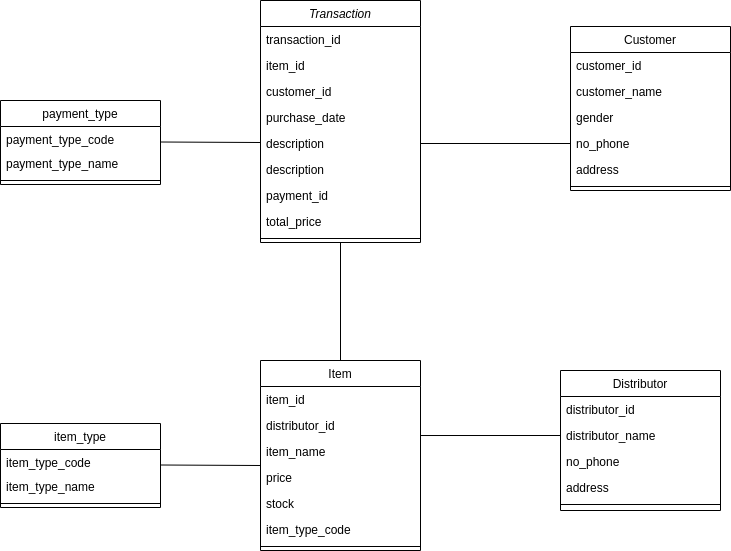

## Cashier System
Build simple Rest API using Spring Boot, h2 as in memory database, JPA, 
and Swagger as documentation. This Application have 4 layer contains: controller,
service, gateway, and repository.



## Getting Started
Run in you local

- Clone this repository
- You can run test and build the project by running `mvn clean package`
- Start the app by typing `mvn spring-boot:run` from the root project directory to start the application.
- Since we're using H2 as our in-memory database, you can launch the console by visiting 
  http://localhost:8080/h2-console
  
## API Documentation

You can check the API documentation by run this application and hit http://localhost:8080/swagger-ui.html

## Spesial Case
- For value items when create transaction, must following this json format:
  ```[{"itemId":3,"total":2},{"itemId":3,"total":2}]```